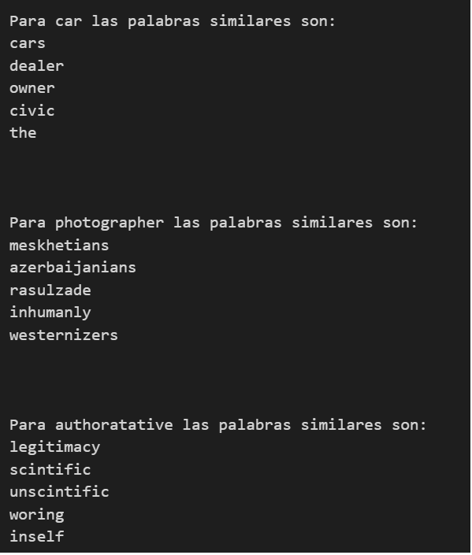

# Desafíos de procesamiento del lenguaje natural

Especialización en IA - UBA (Universidad Nacional de Buenos Aires) - Projectos finales

### Desafío 1:

En el primer desafío, se abordaron los fundamentos de la vectorización de texto, utilizando posteriormente un modelo de clasificación como Naïve Bayes para encontrar similitudes entre textos. Para ello, se empleó el conjunto de datos _20 Newsgroups_ de scikit-learn.

Para la vectorización se siguieron los siguientes pasos:
1. Se instanció un vectorizador.
2. Se entrenó el vectorizador.

Para valorar la similitud entre texto se uso la similitud del coseno.

Luego se optimizaron estos modelo para lograr el maximo valor de la metrica F1-score. El mejor valor obtenido fue de 0.77.

Por ultimo se invirtio la matriz documento-término para estudiar similitudes entre palabras. En la siguiente figura se puede ver un ejemplo de predicciones de palabras similares:

## Muchas gracias!
Sientete libre de contactarte por mail a francoa23@gmail.com por cualquier duda.
Disfruta 😄!!
